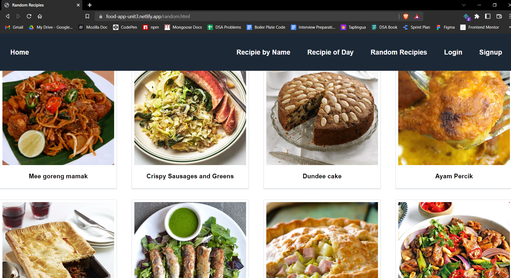

# Food App

Hello everyone, here is my Food App project which I builded in unit-3 with the help of `https://www.themealdb.com/api.php` api. Link of deployment:- https://food-app-unit3.netlify.app/

# Features

- Search any recipie and get details.
- Get recipie of the day.
- Get some random recipies.
- Login and sigup functionality.
- Debouncing feature.
- Responsive layout.

# Screenshots

## 1. Recipie by Name Page

## 2. Recipie of Day Page

## 3. Random Recipies Page

## 4. Login Page

## 5. Signup Page

# Tech Stack

In this project we used following tech stacks:- 
- [HTML](https://developer.mozilla.org/en-US/docs/Web/HTML)
- [CSS](https://developer.mozilla.org/en-US/docs/Web/CSS)
- [JS](https://developer.mozilla.org/en-US/docs/Web/JavaScript)
- [Media Queries](https://developer.mozilla.org/en-US/docs/Web/CSS/Media_Queries/Using_media_queries)

# Connect with author

- [Twitter](https://twitter.com/harshal258)
- [LinkdIn](https://www.linkedin.com/in/harshalpardeshi/)

# Feedback

If you have any feedback or queries, please reach out to me at pardeshiharshal90@gmail.com.
